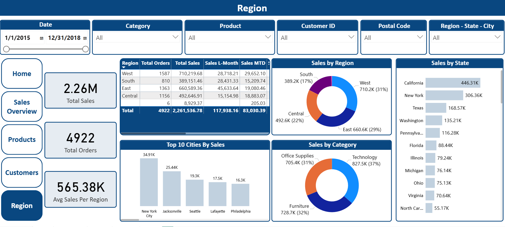
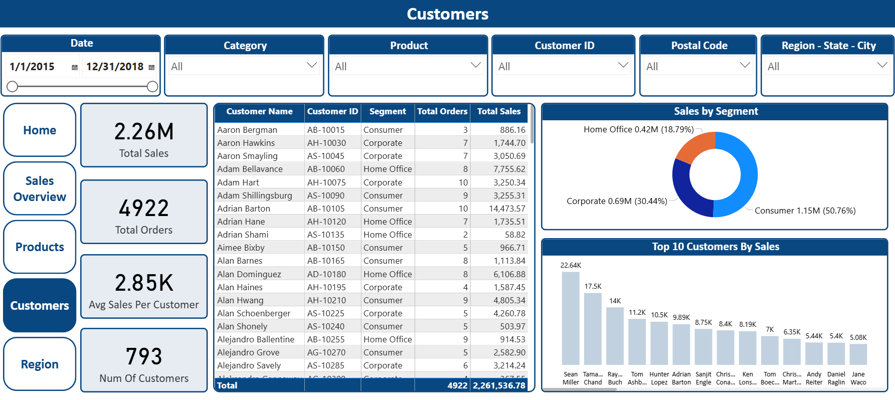
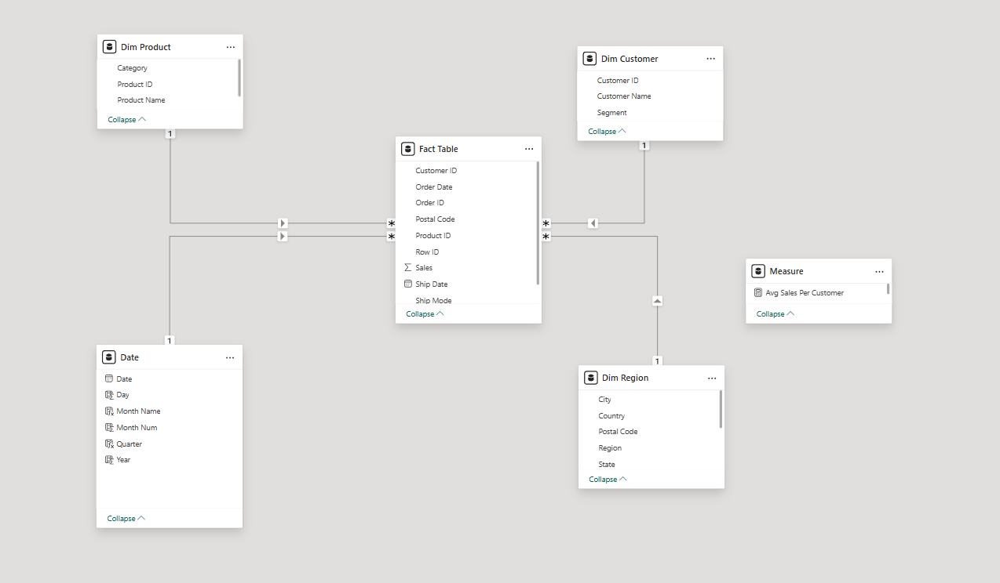
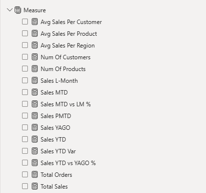

# 📊 Superstore Sales Analysis Dashboard

## 📖 Project Overview
This project involves analyzing sales data for a fictional "Superstore" to identify trends, top-performing products, and regional sales distribution. The goal is to provide actionable insights to stakeholders to improve profitability and operational efficiency.

The analysis is built using **Microsoft Power BI**, utilizing **Power Query** for data transformation and **DAX** for advanced calculations.

## ❓ Problem Statement
The superstore wants to understand:
- Which **Regions** and **States** are generating the highest revenue?
- What are the top-selling **Categories** and **Sub-Categories**?
- How does the sales performance trend over **Time** (Years/Months)?
- Which **Customer Segments** (Consumer, Corporate, Home Office) contribute most to the sales?

## 📂 Dataset Description
The dataset contains sales transactions including:
- **Order Details:** Order ID, Date, Ship Mode.
- **Location:** Country, City, State, Region.
- **Product:** Category, Sub-Category, Product Name.
- **Metrics:** Sales, Quantity, Discount, Profit.

## 🛠️ Tools & Technologies Used
- **Microsoft Power BI Desktop:** Dashboard creation and visualization.
- **Power Query:** Data cleaning (Handling nulls, data types, and formatting).
- **DAX (Data Analysis Expressions):** For calculated measures (Total Sales, YOY Growth, Profit Margin).
- **Excel/CSV:** Raw data source.

## 🔍 Key Insights & Findings
1. **Regional Performance:** The `[Insert Top Region]` region outperforms others, contributing `[X]%` to total sales.
2. **Top Products:** The `[Insert Top Category]` category leads in sales volume.
3. **Sales Trends:** Q4 (End of year) shows a significant spike in sales due to seasonality.
4. **Shipping:** Standard Class is the most preferred shipping mode by customers.

## 📷 Dashboard Screenshots

### 1. Sales Overview

### 2. Regional Analysis

### 3. Product Performance

### 4. Customer Performance

### 5. Data Modeling

### 5. Measures

## 🚀 How to Run
1. Download the `.pbix` file from this repository.
2. Open it in **Microsoft Power BI Desktop**.
3. If the data source path changes, go to `Transform Data` -> `Data Source Settings` and point it to the included CSV file (`Superstore Sales Dataset.csv`).
